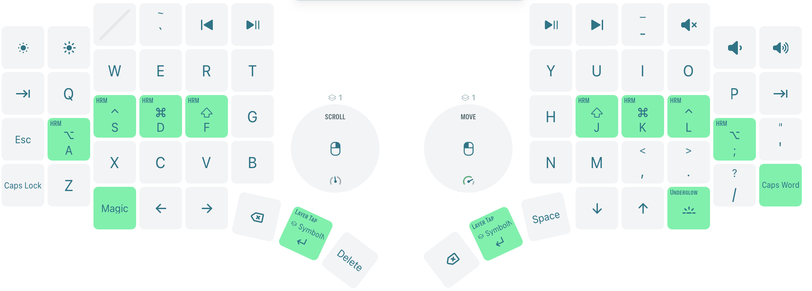
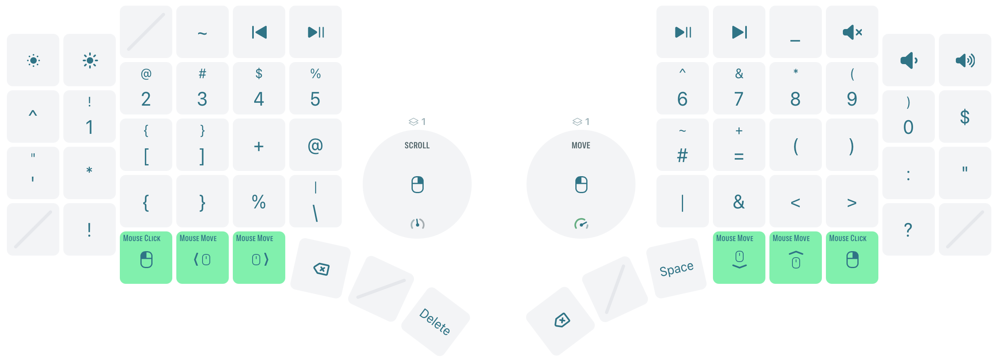

# Sebas' Go60 Layout

This repository contains my personal ZMK configuration for the MoErgo Go60.  
The layout grew out of my daily workflow which is heavily focused on Python
development, and editing everything in Neovim.
It favors homerow modifiers for fast typing with minimal hand movement,
quick layer-taps for navigation, and a thin symbol layer so I can stay
anchored on the home row while typing. ( Perfect to avoid carpal tunnel! )

## Layer Overview

### Base Layer

The base layer keeps the standard alpha arrangement but leans on custom
hold-tap behaviors for every home-row key. This makes it easy to chord common
shortcuts in Neovim or tmux without stretching for dedicated modifier keys. A
Magic layer tap is wired to the left thumb for Bluetooth and RGB controls, and
the right thumb handles RGB toggles plus Enter.

### Symbol & Navigation Layer

The symbol layer groups numbers, punctuation, and mouse-keys to reduce layer
hopping while coding. The trackpad cluster doubles as a pointing-layer with
`mkp`/`mmv` bindings for quick cursor nudges.
Holding either thumb activates this layer, while tapping still gives me a very much desired
an nice positioned Enter key.

## Features

- Homerow-mod (HRM) behaviors with tuned tapping terms per finger.
- Layer-tap thumbs for instant access to the symbol layer without sacrificing Enter.
- Mouse-key bindings on the symbol layer for mouse use without leaving the keyboard.
- Combos for frequently used characters (e.g., underscore) built around my workflow.

## Building and loading Firmware into the Go60

1. Clone this repository (or your fork) and make any changes you need in
   `config/go60.keymap`.
2. Push to GitHub to trigger the included “Build” workflow, or build locally
   using `nix-build config -o combined`.
3. Flash the resulting `go60.uf2` artifact onto each side of the keyboard.
