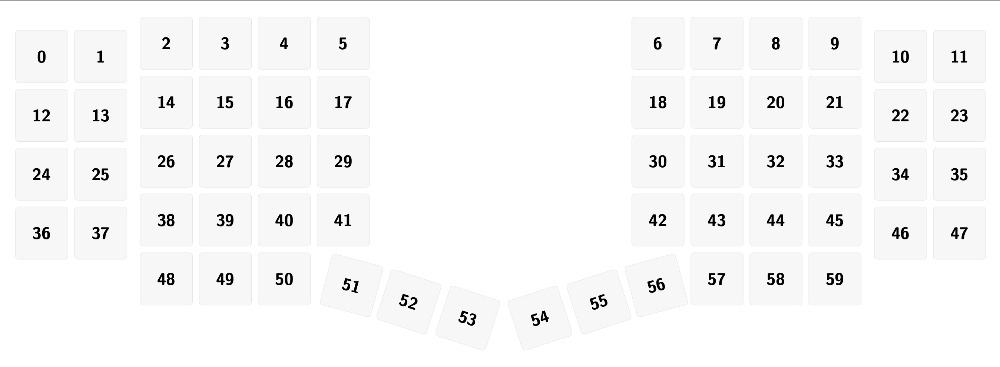

# Sebas' Go60 Layout

This repository contains my personal ZMK configuration for the MoErgo Go60.  
The layout grew out of my daily workflow which is heavily focused on Python
development, and editing everything in Neovim.
It favors homerow modifiers for fast typing with minimal hand movement,
quick layer-taps for navigation, and a thin symbol layer so I can stay
anchored on the home row while typing. ( Perfect to avoid carpal tunnel! )

## Go60 Key Positions

Reference image showing ZMK key positions (positional indices).

ZMK does not reference keys by labels or legends, but by their physical
position index in the keymap. These key positions—are used by features
such as combos, hold-taps, macros, and other position-based behaviors.

## Layer Overview

### Base Layer

The base layer keeps the standard alpha arrangement but leans on custom
hold-tap behaviors for every home-row key. This makes it easy to chord common
shortcuts in Neovim or tmux without stretching for dedicated modifier keys. A
Magic layer tap is wired to the left thumb for Bluetooth and RGB controls, and
the right thumb handles RGB toggles plus Enter.

### Symbol Layer

The symbol layer groups numbers, and punctuation, to reduce hand
movement while coding. The trackpad cluster doubles as a pointing-layer with
`mkp`/`mmv` bindings for quick cursor nudges.
Holding either thumb activates this layer, while tapping still gives a very much desired
an nice positioned Enter key.

### Navigation Layer

The navigation layer is dedicated to cursor movement anchored on the keyboard, mainly on the
home row. Mouse movement is handled through key-based `mmv` bindings at multiple speeds for
both precision and fast traversal, with nearby mouse-click bindings enabling full interaction
without reaching for a physical mouse.

## Features

- Homerow-mod (HRM) behaviors with tuned tapping terms per finger.
- Layer-tap thumbs (hold 55 or 58) for instant access to the symbol layer without sacrificing Enter.
- Combo bindings (hold 55 and 58) to enter navigation layer easily while keeping symbol and Enter keys in position.
- Mouse-key bindings on the symbol layer for mouse use without leaving the keyboard.
- Combos for frequently used characters (e.g., underscore 54 and 59) built around my workflow.

## Building and loading Firmware into the Go60

1. Clone this repository (or your fork) and make any changes you need in
   `config/go60.keymap`.
2. Push to GitHub to trigger the included “Build” workflow, or build locally
   using `nix-build config -o combined`.
   3.Flash the resulting `go60.uf2` artifact onto each side of the keyboard.
